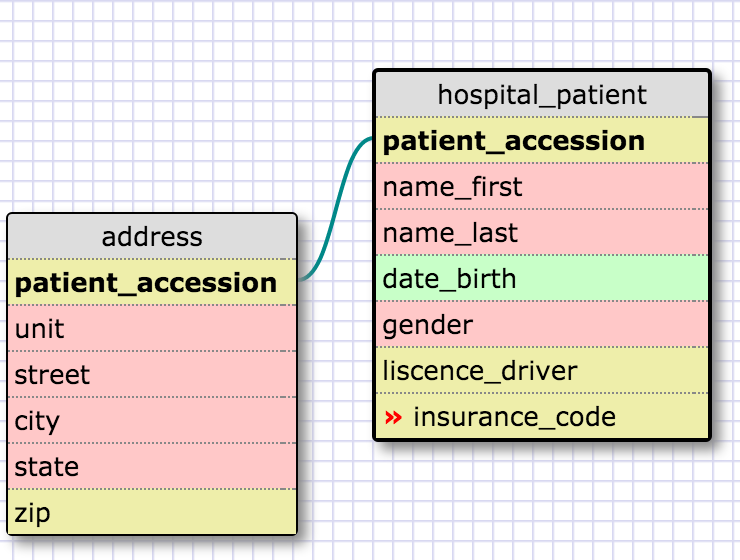
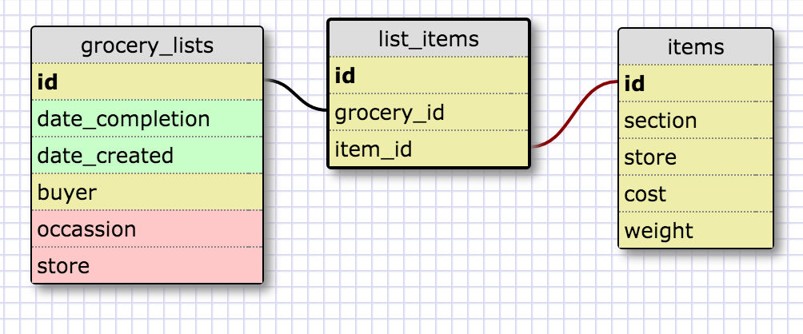

#   
#   

What is a one-to-one database?
	A one-to-one database/relationship is one where a single database entry can on one table can only be connected to a single entry in another table. A case example is an address with all its fields can only be keyed to a single person and that person a single key. 
When would you use a one-to-one database? (Think generally, not in terms of the example you created).
	Not often, I would probably use if there was a value which had more than 3 fields that I wouldn't want to have attached to the values in the primary key table. In this case address is a perfect example because this is a one-to-one where address has many line which would not be ideal to put under the customer as several extra fields. 
What is a many-to-many database?
	A many-to-many database is one where several ids of a table can attach to multiple ids in another table. 
When would you use a many-to-many database? (Think generally, not in terms of the example you created).
	This would probably be used most often in my perspective. For example if I were to do a database on grocery items and grocery stores, several of the same items can be found at several grocery stores.
What is confusing about database schemas? What makes sense?
	I'm wondering if there ever is a best way to organize a database and what happens if something needs to be expanded in the future. Like what if I'm doing teachers in classes and I design it where every class gets one teacher. Eventually I want to add teaching assistants. How is that managed? Can it be done without crashing the system?
	I'm having a little trouble imagining the full scope of a database and I think doing a database that is huge can give a lot of perspective on how this is managed. 