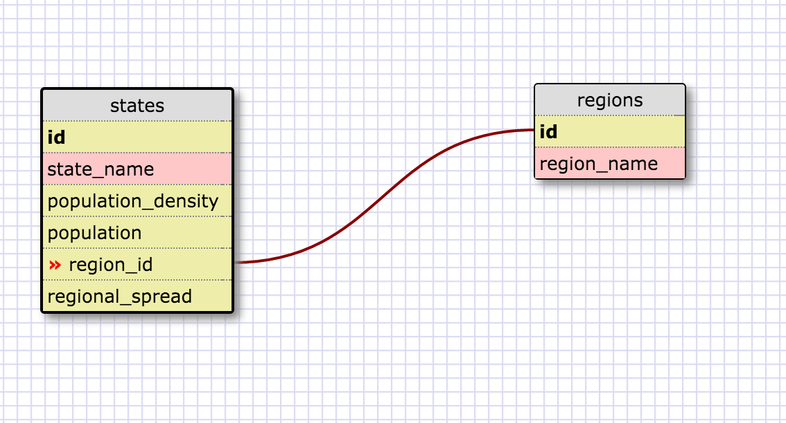

# Introduction to Databases

#### I worked on this challenge [by myself]
#### This challenge took me [2] hours.

## SQL Queries

Paste the correct SQL queries for each of the following:

1. Select all data for all states:
	SELECT * FROM states;
2. Select all data for the regions:
	SELECT * FROM regions;
3. Select the `state_name` and `population` for all states:
	SELECT state_name,population FROM states;
4. Select the `state_name` and `population` for all states ordered by population. The most populous state should be at the top:
	state_name,population FROM states ORDER BY population DESC;
5. Select the 'state_name's for the states in region 7:
	SELECT state_name FROM states WHERE region_id=7;
6. Select the 'state_names' and 'population_density' with a population density over 50 ordered from least to most dense:
	SELECT state_name,population_density FROM states WHERE population_density>50 ORDER BY population_density ASC;
7. Select all state_names for states with a population between 1 million and 1.5 million people:
	SELECT state_name FROM states WHERE population>1000000 AND population<1500000;
8. Select all state_names and region_id ordered by region in ascending order:
	SELECT state_name,region_id FROM states ORDER BY region_id ASC;
9. Select the 'region_name' for the regions with "Central" in the name:
	SELECT region_name FROM regions WHERE region_name='%Central';
	*Note this doesn't work on mine because my SQL regions don't say "Central" on them
10. Select all of the region names and the state names in ascending order by regional id:
	SELECT regions.region_name, states.state_name FROM regions JOIN states ON regions.id = states.region_id;
## `persons` and `outfits` Schema

<!-- Include a link to your schema design here -->
#   

## Reflection
- What are databases for?
	- Databases are used for the storage and retrieval of data. They have specific organization systems and involve use of many tables to retrieve relevant information.
- What is a one-to-many relationship?
	- A one-to-many relationship is when one row on a table can actually be related to many rows on another table. This allows information to be saved in one row but also be used to reference information in many other tables and rows. 
- What is a primary key? What is a foreign key? How can you determine which is which?
	- A primary key is a value on a row that uniquely idetifies that row. A foreign key is a value in a row that points to a primary key in another table. We can tell which is which by having an overal full understanding of the database structure as well as noting the labels of the fields.
	Also in many schemas people will not FK or PK for if something is a foreign or primary key.
- How can you select information out of a SQL database? What are some general guidelines for that?
	- You can select information like with an object or a hash and it and pull information from a single column and row to get a specific value. The general guidelines are you select what columns you want with SELECT. You can select for a specific row/input with putting WHERE

